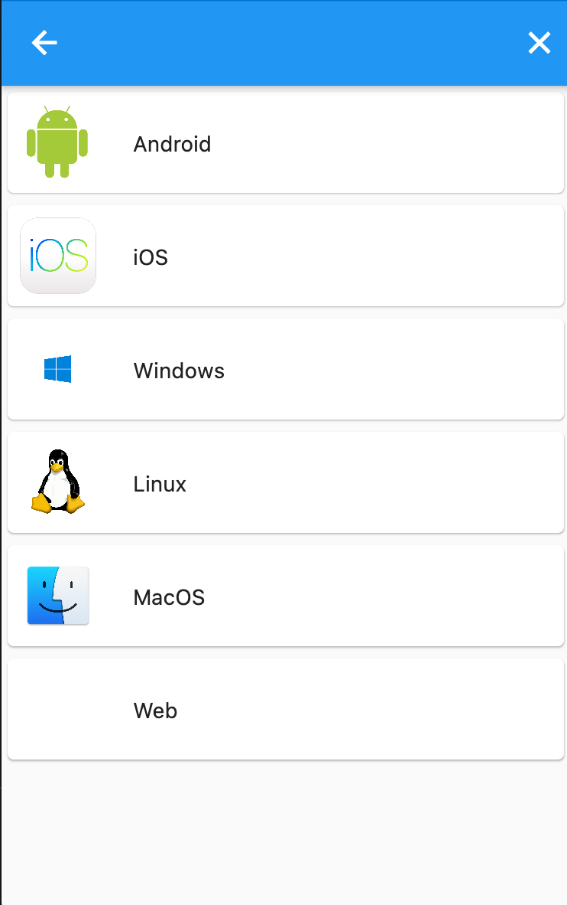
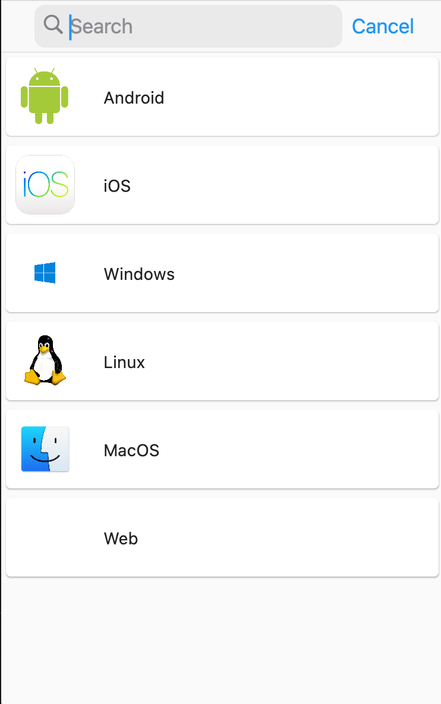
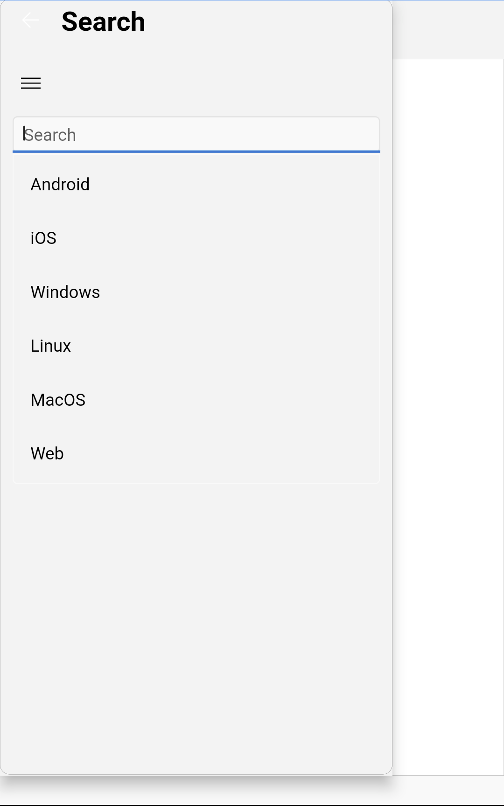

# Flutter Platform Search

Flutter platform search is an abstract implementation of the Flutter search delegate. It is a time saving way to implement a platform adaptive search. 
The example includes reference implementations for Android(Material), iOS(Cupertino) and Windows(FluentUI).

If you are looking for a guide on how to use it check out the blog article: [Flutter platform search](https://quickbirdstudios.com/blog/flutter-adaptive-search-widget/)

## Demo  

| Material (Android)        | iOS (Cupertino)           | Windows (FluentUI)  |
| :------------: |:-------------:| :-----:|
||  | |

## 👤 Author 

This example app and the blog article were created with 💙 by [QuickBird Studios](https://quickbirdstudios.com/).

## 📃 License

The Example app is released under the MIT license. See [LICENSE](LICENSE) for more information.
